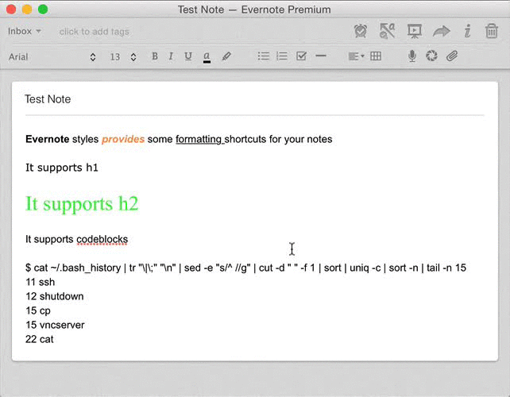

# Evernote Styles

The WYSIWYG editor for Evernote.app is an abortion and trying to apply
consistent styles for headers, important, etc between notes is a massive pain
using the control bar.

Instead, let's use AppleScript to extract a text selection, format it with HTML
and CSS then paste it back into Evernote. This effectively mimics the behaviour
of the Style drawer in Pages.app or similar apps.

## Installation
Using your shortcut manager of choice, bind the scripts in ./shortcuts to key
commands. I use [FastScripts](http://www.red-sweater.com/fastscripts/) to give
me app-specific shortcuts.

## Usage
Select some text inside an Evernote note, hit your shortcut, done.

## Known bugs
* Spacing at the start and end of blocks can double up
* Formatted links in the original text isn't preserved

## Future development
* Language specific code formatter
* Better support for links
* Support for lists, blockquotes, etc
* Externalise styles to a stylesheet

