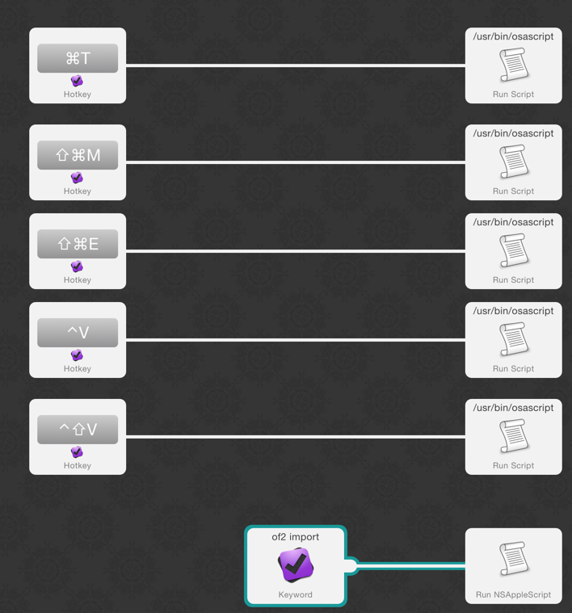

# OmniFocus Shortcuts for Alfred

Some shortcuts for Omnifocus

## Todo View 
Toggle both sidebars.

## Morning Review
Focus on the current Morning Review project at swap to Todo View

## Evening Review
Focus on the current Evening Review project at swap to Todo View

## Verify next actions

## Clean needs-next-action flags

## Import from plaintext

# License

MIT © [Gavin Montague](http://leftbrained.co.uk)
